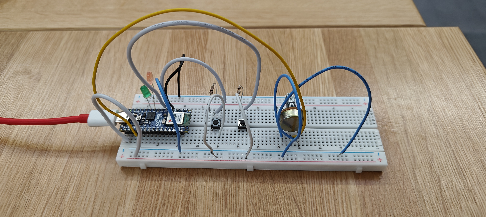

# ReadMe - HW11 Working Document

My finite state password machine consists of 3 elements: 2 *switches* and 1 *potentiometer*. The correct password sequence has 5 steps, exclusively in the below order:

**Step 1:** Max-out potentiometer (turn it all the way to the right)  
**Step 2:** Press *Button 1*  
**Step 3:** Press *Button 2*  
**Step 4:** Press *Button 2* again  
**Step 5:** Press *Button 1*  

If the above sequence is entered correctly, a green LED lights up visualizing that the password entered is correct, else a red LED turns on.

<p align = "center">

<br>
Figure 1: Finite State Diagram </p>

In my code, I've made use of a variable called *stepCount* to keep a track of the total steps completed, irrespective of whether the sequence is correct or not. The sequence is verified only after the *stepCount* reaches 5 i.e. at the end of the full input cycle.

Similarly, to check whether the sequence being entered is correct or not, I've made use of a boolean flag variable called *correct_flag*. It contains a value of 1 as long as the sequence being entered is correct. The moment a wrong input is detected, the flag turns to 0.

The LED statuses are based on the flag values. Depending on *correct_flag* having a value of 1 or 0, the green or red LED lights up accordingly.

```
if(stepCount==5)
  {
    if(correct_flag==1)
    {
      digitalWrite(7,LOW); //red LED
      digitalWrite(8,HIGH); //green LED
    }
    else if(correct_flag==0)
    {
      digitalWrite(7,HIGH); //red LED
      digitalWrite(8,LOW); //green LED
    }
  }
```

Moreover, since a potentiometer reading is involved in the overall sequence, I've created a variable *potVal_Dynamic* that stores the value being passed through the potentiometer. The value is then evaluated at each step to check for any deviations.

```
int potVal_Dynamic = analogRead(A0);

//condition being checked at each step for potentiometer status
potVal_Dynamic >= 4090
```

The max. value for a potentiometer is 4095. I'm checking for values that are equal to or greater than 4090 to account for slight deviations in potentiometer readings. These deviations are caused due to external factors, hence, having a "zero error" results in the sequence's accuracy.

<p align = "center">

<br>
Figure 2: Schematic Diagram of the Circuit
<br>
<br>

<br>
Figure 3: Actual Arduino Circuit
<br>
<br>

<br>
Figure 4: Circuit - Password Accepted Scenario
<br>
<br>

<br>
Figure 5: Circuit - Password Rejected Scenario </p>
